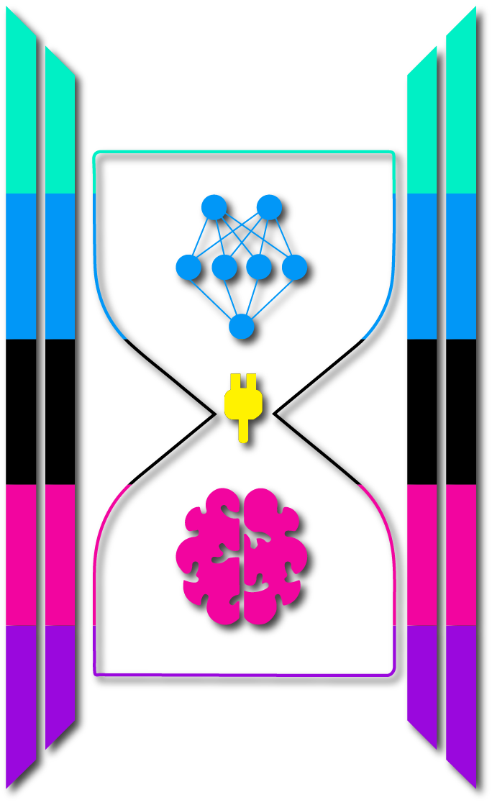
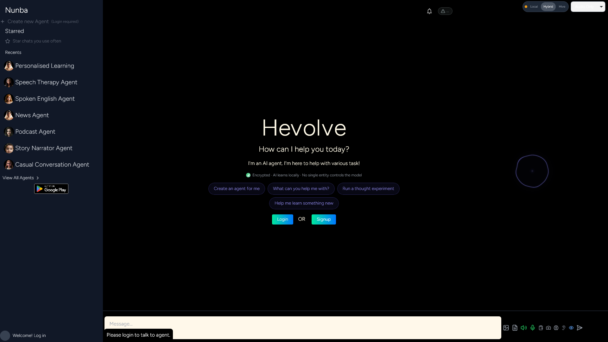
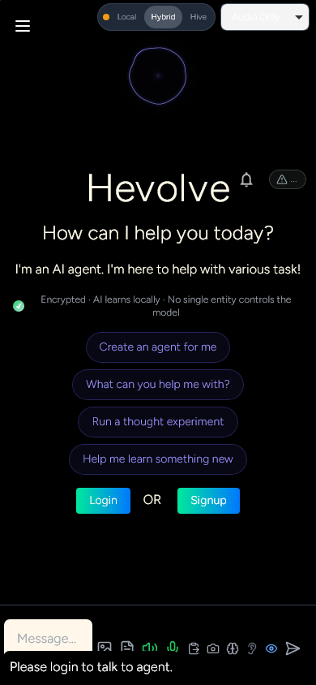

<p align="center">
  
</p>

<h1 align="center">Nunba</h1>
<p align="center"><strong>A Friend, A Well Wisher, Your LocalMind.</strong></p>

<p align="center">
  <a href="https://hevolve.ai"></a>
  <a href="https://docs.hevolve.ai"></a>
  <a href="https://github.com/hertz-ai/Nunba/releases"></a>
  <a href="LICENSE"></a>
</p>

Nunba is an assistant that lives on your computer. The models run on your
machine, so it works with the wifi off, costs nothing a month, and what you
type stays where you typed it. You can watch the network to check.

There is a switch in the top right of every screen: **Local, Hybrid, Hive**.
It decides where your words are processed. Local runs everything on this
machine. Hybrid brings in a provider you supply a key for, on the turns that
need one. Hive federates with your own peers, sharing learning as deltas while
raw data stays home. Every assistant makes this decision for you, somewhere
you cannot see. Here it is a visible control and you can flip it mid
conversation.

On a hard question a frontier model beats anything that fits on a laptop, and
Hybrid exists for exactly that. Most of what people ask in a day is not that.

---

## Install

| Platform | Download | Notes |
|---|---|---|
| **Windows 10/11** | [Nunba_Setup.exe](https://github.com/hertz-ai/Nunba/releases/latest/download/Nunba_Setup.exe) | Signed (Azure Trusted Signing). The setup wizard reads your GPU and pulls a model that fits. |
| **Linux (any distro)** | [Nunba-x86_64.AppImage](https://github.com/hertz-ai/Nunba/releases/latest/download/Nunba-x86_64.AppImage) | `chmod +x` and run. |
| **Linux (.deb)** | [Releases](https://github.com/hertz-ai/Nunba/releases/latest) | Debian / Ubuntu. `sudo dpkg -i nunba_*.deb`. |
| **macOS 13+** | not attached yet | The dmg build currently hangs in CI and the current release ships without it. Watch [Releases](https://github.com/hertz-ai/Nunba/releases); building from source works today. |
| **Backend only** (headless) | [HART OS](https://github.com/hertz-ai/HARTOS) | Run the runtime from source and point any OpenAI-compatible client at `:6777`. |

**What your machine gets you.** The wizard sizes the install to the hardware,
and at runtime the VRAM manager decides what loads where, checking each
model's budget against free memory and placing it gpu, cpu-offload or
cpu-only, evicting the least recently used when something new needs room.
A 10GB+ CUDA card unlocks speculative decoding, a 0.8B draft speaking while
the main model verifies. Smaller GPUs run the main model alone. Without CUDA,
chat runs on CPU with a compact main model, 0.8B or 2B class, and swapping in
any other GGUF is configuration, not surgery. Voices scale the same way: the
full ladder on bigger machines, the lighter engines on a 6GB card.

---

## What it looks like

<p align="center">
  
</p>

That switch in the top right is the whole argument about who decides, reduced
to a control you can actually flip.

<p align="center">
  
</p>

Same build on Android, and the switch is still the first thing on screen.

---

## What you can do with it

| | How |
|---|---|
| Chat with a local model | Open Nunba, type. Draft-first decoding keeps first token fast. |
| Voice in, voice out | Press the mic. Whisper transcribes locally, and a six-engine TTS ladder (`tts/`) speaks back, from Indic Parler's 22 Indic languages to Piper on plain CPU. |
| Show it your screen or camera | Consent toggle in admin. MiniCPM VLM describes frames on-device. |
| Spawn an autonomous agent | "Research X every Monday and post the summary." The runtime builds the skill, the constitutional filter clears it, a spark budget caps what it can spend. |
| Put your agent on your platforms | Admin, Channels: Discord, WhatsApp, Slack, Telegram, Signal and the rest of the 31-adapter catalog in [HART OS](https://github.com/hertz-ai/HARTOS). Same agent everywhere. |
| Connect MCP servers | The `/api/mcp` HTTP bridge (bearer auth) makes any MCP server available to your local agent. |
| Add a cloud provider | Admin, Models. OpenAI, Anthropic, Google, Groq, Mistral, DeepSeek and the rest of the 16-provider gateway, routed by cost and latency, keys in an encrypted vault. |
| Use it from three devices | Web SPA, this desktop app, and React Native on Android share one conversation and replay missed turns. |

Keys live in `~/.nunba/ai_keys.enc`, a Fernet vault keyed from machine
identity via PBKDF2 (`desktop/ai_key_vault.py`).

---

## The stack

**HART** is the bare agent engine, in the
[HARTOS repo](https://github.com/hertz-ai/HARTOS). It runs from source and
listens on `:6777`. There is no PyPI package yet. **HART OS** is that engine
plus the operator screens. **Nunba**, this repo, is the consumer app: it
bundles HART OS inside one signed installer and adds the chat, social,
encounter and kids-learning screens a person who never opens a terminal will
actually use.

## How it learns

The runtime improves from its own use. Usage generates candidate
improvements, a constitutional filter passes judgement (33 immutable rules
plus a cultural-wisdom list, `cultural_wisdom.py` in HART OS), survivors run
in sandboxes against your live baseline, and only a measured winner commits.
Winning deltas federate to your peers. Raw conversations never leave the
machine, and you can pause, veto or switch the whole loop off.

The learning core itself, HevolveAI, is closed source, loaded at runtime as a
signed binary with a stub fallback when absent. Whether that is compatible
with the rest of the argument is a live question we keep in public rather
than in a drawer:
[open problem 9](https://github.com/hertz-ai/HARTOS/blob/main/OPEN_PROBLEMS.md).

## Different from Ollama or LM Studio?

They are model servers, and good ones. Nunba sits a layer up: the same
llama.cpp underneath, then voice, vision, agents, channels, sync and
federation on top, in one signed installer anyone can run. If what
you want is to serve GGUF models to your own tools, use Ollama and be happy.
If you want the assistant those models make possible, that is this.

## The money part

Lending idle compute pays the node that serves it: 90% of the revenue when a
peer witnessed the work, 50% when unwitnessed
(`integrations/social/ad_service.py` in HART OS). The network split is 90/9/1
across contributors, regional hosts and hevolve.ai
(`revenue_aggregator.py`), and reward scaling caps any single entity at a 5%
influence weight (`security/hive_guardrails.py`).

---

## From source

```bash
git clone https://github.com/hertz-ai/Nunba.git
cd Nunba
python -m venv .venv && .venv/Scripts/activate    # Windows
# source .venv/bin/activate                       # macOS / Linux
pip install -r requirements.txt
pip install -e ../HARTOS      # clone github.com/hertz-ai/HARTOS alongside
cd landing-page && npm install && npm run build && cd ..
python main.py --port 5000
```

> **Status: public alpha.** The desktop app, the runtime and the channel
> adapters are in daily use. APIs still move. Issues and PRs are wanted, and
> [CONTRIBUTING.md](CONTRIBUTING.md) says where the interesting problems are.

---

## Documentation

| Section | What's in it |
|---|---|
| [Downloads](https://docs.hevolve.ai/downloads/) | Signed installers and the headless backend |
| [Quickstart](https://docs.hevolve.ai/getting-started/quickstart/) | Install to first chat |
| [Features](https://docs.hevolve.ai/features/overview/) | Auto-evolve, multimodal, federation, channels, social |
| [Architecture](https://docs.hevolve.ai/architecture/overview/) | Topology, PeerLink, draft-first dispatch |
| [HART OS repo](https://github.com/hertz-ai/HARTOS) | The runtime underneath, its capability map and open problems |

---

## License

[Apache License 2.0](LICENSE). Free for any use. Built by
[HevolveAI](https://hevolve.ai) on [HART OS](https://github.com/hertz-ai/HARTOS)
and the [Hevolve Database](https://github.com/hertz-ai/Hevolve_Database).

> *Nunba: A Friend, A Well Wisher, Your LocalMind.*
