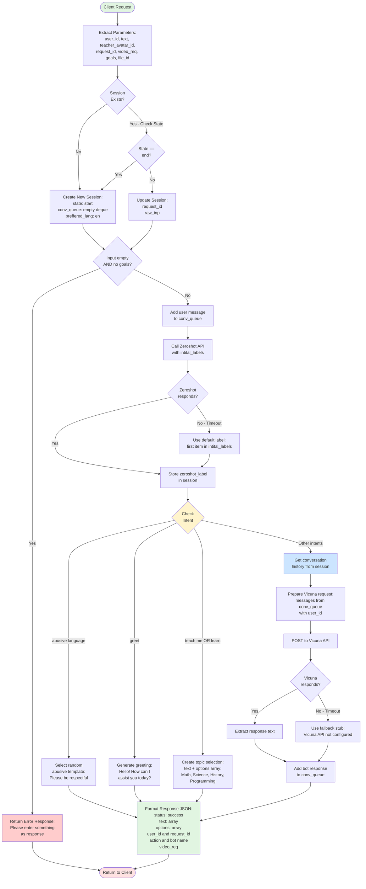
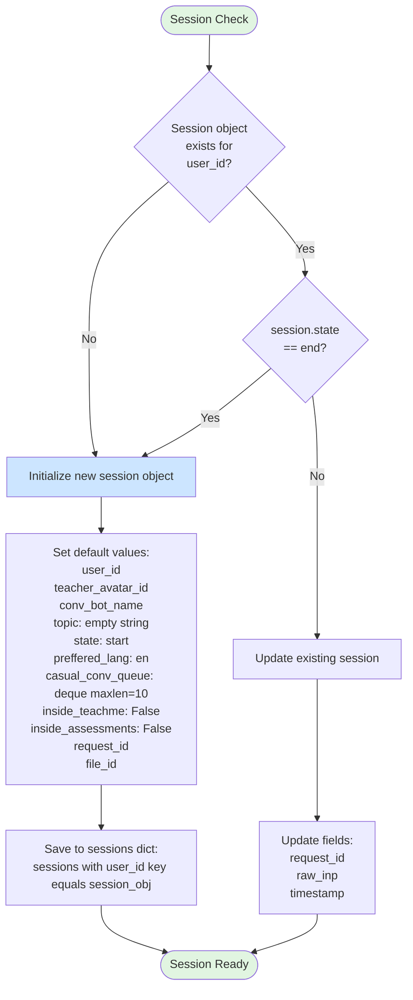
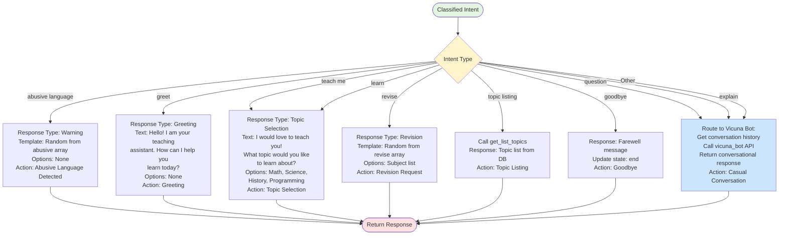
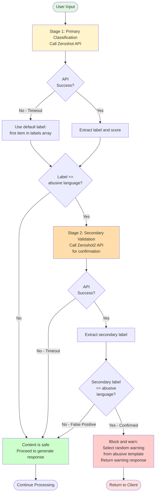
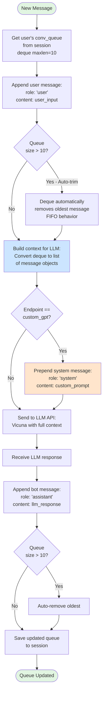
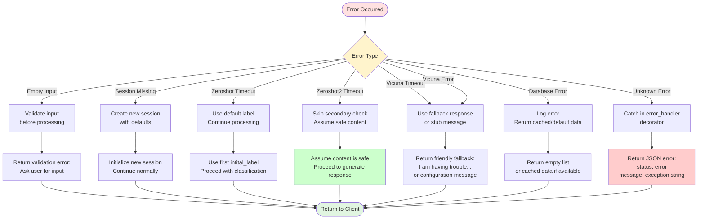
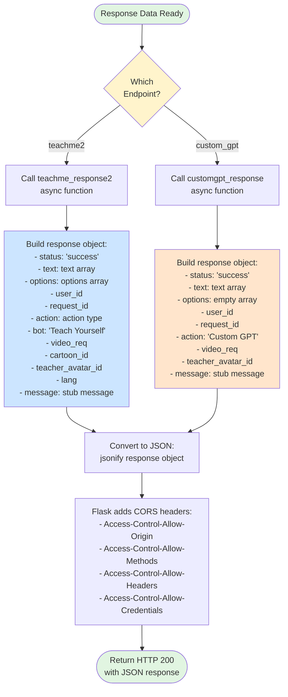
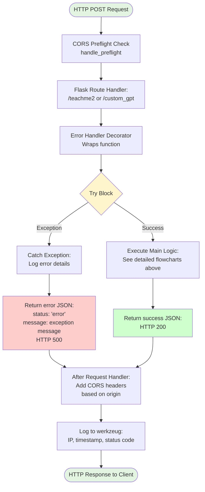

# Chatbot API Flowcharts

## 1. /teachme2 Endpoint - Complete Flow

---

## 2. /custom_gpt Endpoint - Complete Flow

```mermaid
flowchart TD
    Start([Client Request]) --> Extract[Extract Parameters:<br/>user_id, text, teacher_avatar_id,<br/>request_id, video_req, create_agent,<br/>prompt_name, file_id, prompt_id, raw_inp]

    Extract --> ValidateInput{Input<br/>empty?}

    ValidateInput -->|Yes| ErrorEmpty[Return Error:<br/>Request cannot be blank]
    ValidateInput -->|No| CheckGeneralSession

    ErrorEmpty --> End([Return to Client])

    CheckGeneralSession{General<br/>session exists?}
    CheckGeneralSession -->|No| CreateGeneral[Create general session<br/>using create_sessions]
    CheckGeneralSession -->|Yes| CheckCustomSession

    CreateGeneral --> CheckCustomSession

    CheckCustomSession{Custom<br/>session exists<br/>OR state not equal end?}

    CheckCustomSession -->|No| CreateCustom[Create custom session:<br/>conv_queue: empty deque<br/>prompt: You are a helpful<br/>AI assistant<br/>prompt_id and file_id<br/>state: start]
    CheckCustomSession -->|Yes| UpdateCustom[Update custom session:<br/>request_id<br/>teacher_avatar_id<br/>file_id]

    CreateCustom --> AddMessage
    UpdateCustom --> AddMessage

    AddMessage[Add user message to<br/>custom conv_queue:<br/>role: user<br/>content: raw_inp or inp] --> PrepareLabels

    PrepareLabels[Prepare content labels:<br/>change language, revision,<br/>topic listing, abusive language,<br/>explain, question, learn,<br/>affirm, goodbye, greet] --> CallZeroshot1

    CallZeroshot1[Call Zeroshot API<br/>for content filtering] --> Zeroshot1Success{Zeroshot<br/>responds?}

    Zeroshot1Success -->|Yes| StoreLabel[Store zeroshot_label]
    Zeroshot1Success -->|No| DefaultLabel[Use default label]

    DefaultLabel --> StoreLabel

    StoreLabel --> CheckAbusive{Label ==<br/>abusive language?}

    CheckAbusive -->|Yes| CallZeroshot2[Call Zeroshot2 API<br/>for double-check]
    CheckAbusive -->|No| BuildRequest

    CallZeroshot2 --> Zeroshot2Success{Zeroshot2<br/>responds?}

    Zeroshot2Success -->|Yes| Zeroshot2Result{Still<br/>abusive?}
    Zeroshot2Success -->|No| BuildRequest

    Zeroshot2Result -->|Yes| ResponseAbusive[Select random<br/>abusive template:<br/>Let us keep the conversation<br/>positive]
    Zeroshot2Result -->|No| BuildRequest

    ResponseAbusive --> FormatResponse

    BuildRequest[Build request_data:<br/>Step 1: System message with<br/>custom prompt<br/>Step 2: All messages from<br/>conv_queue] --> CallVicuna

    CallVicuna[POST to Vicuna API:<br/>messages: request_data<br/>user_id<br/>prompt_id<br/>create_agent: flag<br/>custom_agent: true] --> VicunaSuccess{Vicuna<br/>responds?}

    VicunaSuccess -->|Yes| ExtractResponse[Extract response text<br/>from Vicuna result]
    VicunaSuccess -->|No - Timeout| VicunaFallback[Fallback response:<br/>Need user_id and text<br/>to create agent]

    ExtractResponse --> AddBotMessage
    VicunaFallback --> AddBotMessage

    AddBotMessage[Add bot response to<br/>conv_queue:<br/>role: assistant<br/>content: response] --> FormatResponse

    FormatResponse[Format Response JSON:<br/>status: success<br/>text: array with response<br/>options: empty array<br/>user_id and request_id<br/>action: Custom GPT<br/>video_req] --> End

    style Start fill:#e1f5e1
    style End fill:#ffe1e1
    style ErrorEmpty fill:#ffcccc
    style CheckAbusive fill:#fff4cc
    style CallZeroshot2 fill:#ffddaa
    style BuildRequest fill:#cce5ff
    style FormatResponse fill:#e1f5e1
```

---

## 3. Session Initialization Logic

---

## 4. Intent Classification & Routing (/teachme2)

---

## 5. Content Moderation Flow (/custom_gpt)

---

## 6. Conversation Queue Management

---

## 7. Error Handling Decision Tree

---

## 8. Response Formatting Flow

---

## 9. Complete Request Lifecycle

---

## Summary of Flowchart Types

| Flowchart | Purpose | Key Features |
|-----------|---------|--------------|
| 1. /teachme2 Complete Flow | End-to-end request processing | Shows all decision points and branches |
| 2. /custom_gpt Complete Flow | End-to-end request processing | Includes dual session and two-stage filtering |
| 3. Session Initialization | Session lifecycle management | Create vs update logic |
| 4. Intent Routing | /teachme2 intent handling | All possible intent paths |
| 5. Content Moderation | /custom_gpt filtering | Two-stage validation process |
| 6. Conversation Queue | Message history management | FIFO queue with maxlen=10 |
| 7. Error Handling | Failure scenarios | Graceful degradation strategies |
| 8. Response Formatting | JSON response building | Different formats per endpoint |
| 9. Complete Lifecycle | Full HTTP request cycle | CORS, error handling, logging |
