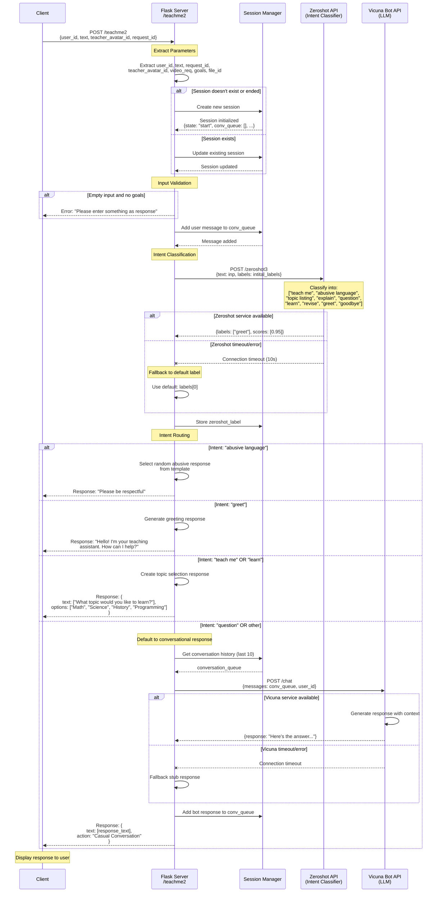
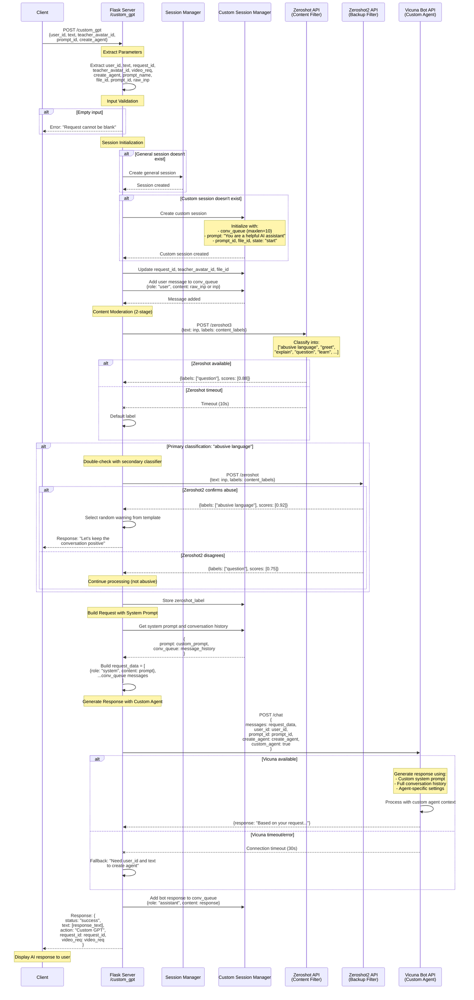
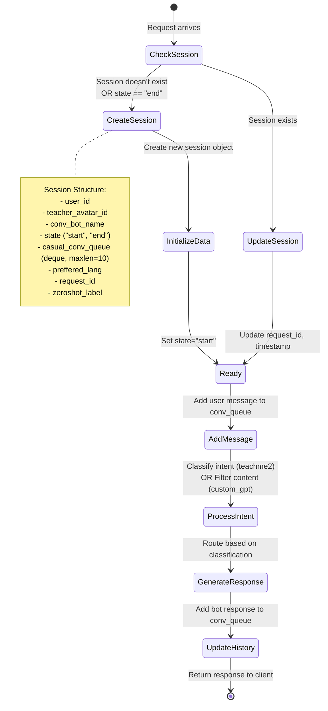

# Chatbot API Sequence Diagrams

## 1. /teachme2 Endpoint - Educational Chatbot

---

## 2. /custom_gpt Endpoint - Custom AI Assistant

---

## 3. Key Differences Between Endpoints

| Feature | /teachme2 | /custom_gpt |
|---------|-----------|-------------|
| **Purpose** | Educational tutoring | General-purpose AI assistant |
| **Session Type** | Single session | Dual sessions (general + custom) |
| **Intent Classification** | Routes to different flows | Only for content moderation |
| **System Prompt** | Fixed teaching prompt | Customizable via prompt_id |
| **Agent Creation** | No agent creation | Supports create_agent flag |
| **Response Options** | Includes topic selection UI | Pure text responses |
| **Content Filtering** | Single-stage (zeroshot) | Two-stage (zeroshot + zeroshot2) |
| **Conversation Context** | Last 10 messages | Last 10 messages with system prompt |

---

## 4. External Service Dependencies

### Zeroshot Service
- **URL**: `http://azurekong.hertzai.com:8000/zeroshot3`
- **Timeout**: 10 seconds
- **Purpose**: Intent classification, content moderation
- **Fallback**: Returns default label on failure

### Zeroshot2 Service
- **URL**: `http://azurekong.hertzai.com:8000/zeroshot`
- **Timeout**: 10 seconds
- **Purpose**: Secondary validation for abusive content
- **Used by**: /custom_gpt only

### Vicuna Bot Service
- **URL**: `http://azure_all_vms.hertzai.com:6777/chat`
- **Timeout**: 30 seconds
- **Purpose**: LLM-powered conversational responses
- **Features**:
  - Multi-turn conversations
  - Custom system prompts
  - Agent creation
  - Context management

---

## 5. Session Management Flow

---

## 6. Error Handling & Fallbacks

Both endpoints implement graceful degradation:

1. **External Service Timeout**
   - Zeroshot: Falls back to default label (first in list)
   - Vicuna: Returns stub response or error message

2. **Empty Input**
   - Returns validation error asking for input

3. **Session State**
   - Automatically creates new session if missing or ended
   - Maintains conversation history up to 10 messages

4. **Network Errors**
   - Catches exceptions and logs errors
   - Returns friendly error messages to user
   - Continues operation without crashing
